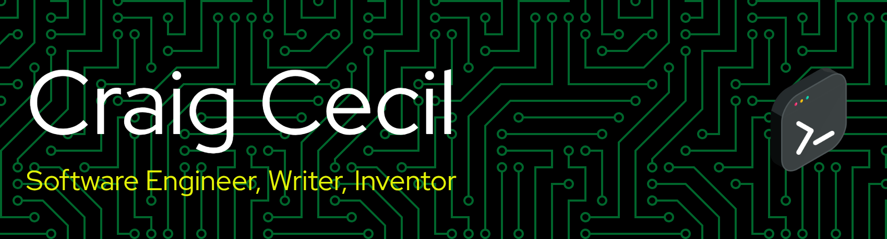

Welcome to my profile. I'm a senior software engineer working at Leidos and I specialize in front of the front-end web engineering. What's that? Basically, everything browser-related, including HTML, CSS, JavaScript, UX, Accessibility, and Performance. I've been designing and buiding websites, web apps, PWAs, and native mobile apps since 1995. I also specialize in design systems at scale, and have an interest in late-bound, loosely-typed programming languages.

I've previously worked at Northrop Grumman, Lockheed Martin, Peraton, and Verizon and have worked with multiple federal agencies, including DHS, FEMA, GSA, IRS, NIH, and the VA. I've also designed, developed, and published commercial software sold in major electronics outlets, such as Fry's and Best Buy.

- 🔭 I’m currently working on the UEF Design System for the Social Security Administration (SSA) and integrating AI workflows into the system.
- 🌱 I’m currently learning how to leverage LLMs, prompt engineering, and workflows for maximum returns.
- 📫 How to reach me: www.craigcecil.com
- ⚡ Fun fact: I obtained my superpowers at age 14 when I was struck by lightning.
